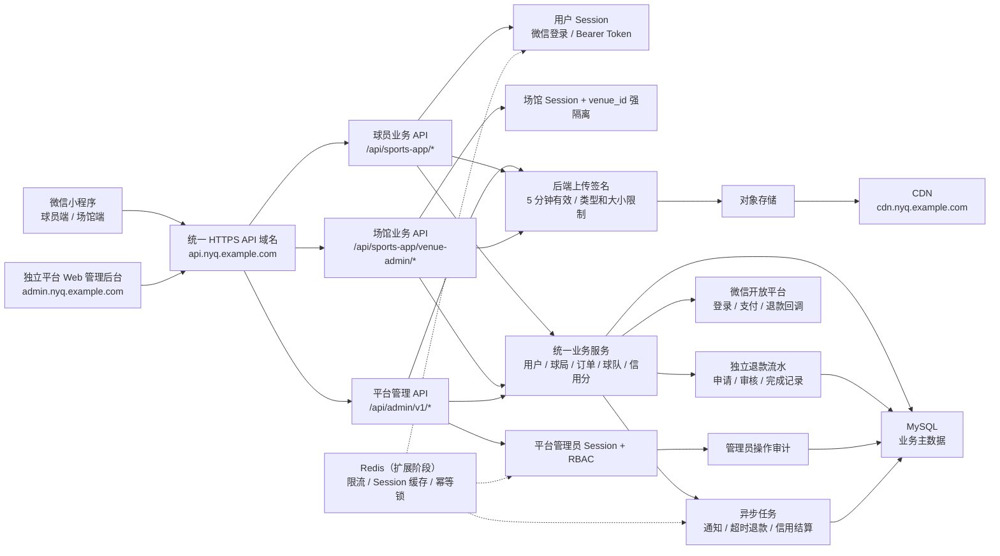

# 宁约球平台完整架构

## 域名建议

- `api.nyq.example.com`：小程序、场馆端和平台 Web 管理后台共用的 HTTPS API 域名。
- `admin.nyq.example.com`：独立 Web 管理后台静态站点。
- `cdn.nyq.example.com`：图片和视频访问域名。

三者可以属于同一个备案主域名，但不建议把管理后台页面、业务 API 和对象存储都混在同一进程。当前代码已经用 `/api/sports-app/*` 与 `/api/admin/v1/*` 隔开权限边界，后续可以在网关层继续兼容旧小程序路径，并逐步迁移到 `/api/player/v1/*`、`/api/venue/v1/*`。

## 已落地的安全边界

1. 生产环境业务身份只接受持久化 Bearer Session，不再信任 `X-User-Id`；开发环境可显式保留 mock。
2. 场馆账号会绑定一个确定的 `venue_id`，场馆后台查询在 SQL 层直接加入场馆条件；无绑定场馆时返回空数据，不再展示全部已审核场馆。
3. 退款申请写入 `sports_refund_request`，订单表只保留当前状态；场馆、平台和自动处理均记录处理人、时间与结果。
4. 平台后台使用独立管理员表、12 小时 Session、来源域名限制、角色权限矩阵和操作审计，不复用小程序用户 Token。
5. 上传先调用后端签名接口，服务端限制对象 key、MIME、大小和有效期；浏览器不持有对象存储密钥。

## 上线前仍需接入

1. 部署对象存储上传网关，使其验证 `policy` 和 `signature` 后再写入实际 OSS/COS/S3。
2. 接入真实微信支付验签、退款 API 和回调幂等处理；当前支付仍是 mock/预留。
3. 为管理员登录和场馆登录增加网关限流；规模扩大后把 Session、限流和任务锁迁移到 Redis。
4. 独立实现 `admin.nyq.example.com` 前端，仅调用 `/api/admin/v1/*`，不要直连数据库。
