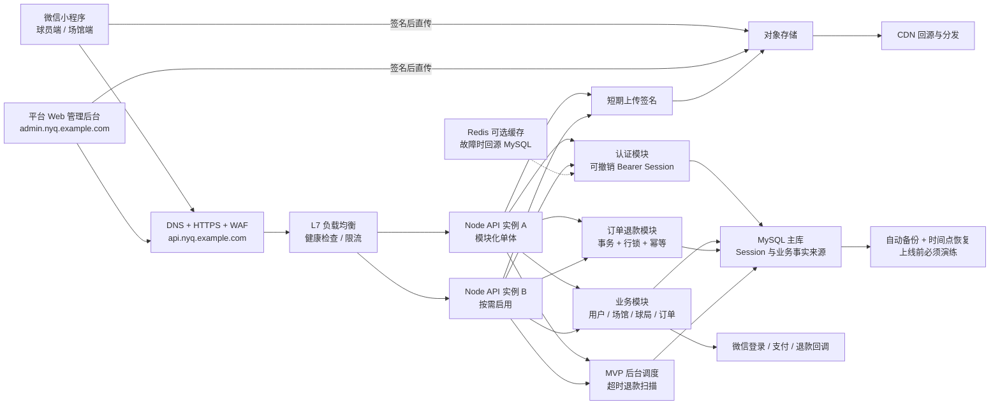
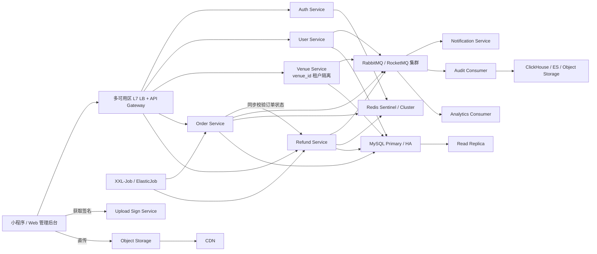

# 宁约球平台架构

## 审查结论

这份审查清单指出了若干扩展阶段风险，但把“图中未画部署细节”直接等同于 P0 故障，并要求 MVP 立即微服务化，并不准确。宁约球当前面向 1-5 个场馆、几百用户，适合采用可横向扩容的模块化单体；真实支付上线前，应先完成数据库备份恢复、实例健康检查和关键流程幂等，而不是先承担微服务、MQ、Redis Cluster 和多套数据存储的运维成本。

| # | 判定 | 当前处理 |
|---|---|---|
| 1 | 部分成立 | 单一域名是逻辑入口，不等于单实例。部署拓扑明确为 L7 负载均衡后可运行多个无状态 API 实例。 |
| 2 | 风险成立但不是当前 P0 | MVP 使用单主库可行；真实支付前必须启用自动备份、时间点恢复和故障演练，扩展阶段增加只读副本/高可用。 |
| 3 | 不成立 | 当前是有意设计的模块化单体，不冒充微服务。达到明确容量或团队边界后再拆用户、场馆、订单退款、通知服务。 |
| 4 | 已明确 | 场馆 Session 固定携带 `venue_id`，所有场馆资源在 SQL 查询层带租户条件。 |
| 5 | 已修复 | 订单、退款流水、报名状态和信用扣分使用同一 MySQL 事务及 `FOR UPDATE` 行锁。 |
| 6 | 建议不采纳 JWT | 认证模块统一签发可撤销的 opaque Bearer Session。JWT 不是认证中心的必要条件，当前方案更容易封禁和退出。 |
| 7 | 已明确 | Session 的事实来源是 MySQL；Redis 当前只是缓存，因此可降级回源。扩展后幂等锁/限流使用 Sentinel 或 Cluster，并对相关写操作失败关闭。 |
| 8 | 已明确 | 客户端先向 API 获取短期签名，再直传对象存储；读取经 CDN，不让文件流经业务服务。 |
| 9 | 分阶段处理 | MVP 审计写 MySQL；达到持续高写入量后通过 MQ 投递到 ClickHouse/ES/低成本对象存储。 |
| 10 | 已补 MVP 调度 | Node 后台任务定时扫描超时退款，事务行锁允许多实例安全执行；任务量增长后迁移到独立调度器。 |
| 11 | 已兼容 | 新增 `/api/player/v1/*` 和 `/api/venue/v1/*` 别名；旧 `/api/sports-app/*` 暂时保留，避免小程序立即迁移。 |
| 12 | 扩展阶段引入 | 当前同步事务不依赖 MQ；通知、审计、支付事件量上升时再引入 RabbitMQ/RocketMQ。 |

## 域名规划

- `api.nyq.example.com`：统一 API 逻辑域名，可指向负载均衡和多个实例。
- `admin.nyq.example.com`：独立平台 Web 管理后台。
- `cdn.nyq.example.com`：对象存储 CDN 访问域名。

三者可以共用同一个备案主域名，但部署和权限边界相互独立。

## 当前 MVP 可部署架构

代码本身已经支持多 API 实例：Session 和业务状态不保存在进程内。是否真正具备高可用，取决于部署时是否配置 L7 负载均衡、至少两个实例、数据库备份和监控；架构图不能替代这些部署工作。

## 扩展阶段目标架构

当达到 10 个以上场馆、真实支付稳定运行、后台任务或审计写入成为瓶颈时，再演进为下图：

## 扩展触发条件

满足任意一项再引入相应基础设施：

1. 单实例 CPU 持续超过 60% 或 P95 延迟超过 300ms：增加 API 实例和 L7 负载均衡。
2. MySQL CPU/IO 持续超过 60%、慢查询明显或读取占比过高：优化索引后增加只读副本。
3. 通知、审计、支付事件需要削峰或可靠重试：引入 MQ 和 Outbox 模式。
4. 定时任务超过单进程可控范围或需要人工补偿：迁移到分布式调度中心。
5. 审计写入持续影响业务库：通过 MQ 迁移到独立日志存储。
6. 团队出现独立领域负责人或单模块发布频率显著不同：从模块化单体拆分对应服务。

## 上线前仍需完成

1. 部署对象存储上传网关并验证 `policy`、`signature`、MIME、大小和有效期。
2. 接入真实微信支付验签、退款 API、回调幂等键和支付对账。
3. 配置 L7 健康检查、数据库自动备份、恢复演练、错误告警和关键业务指标。
4. 实现 `admin.nyq.example.com` 前端，仅调用 `/api/admin/v1/*`，不直连数据库。
